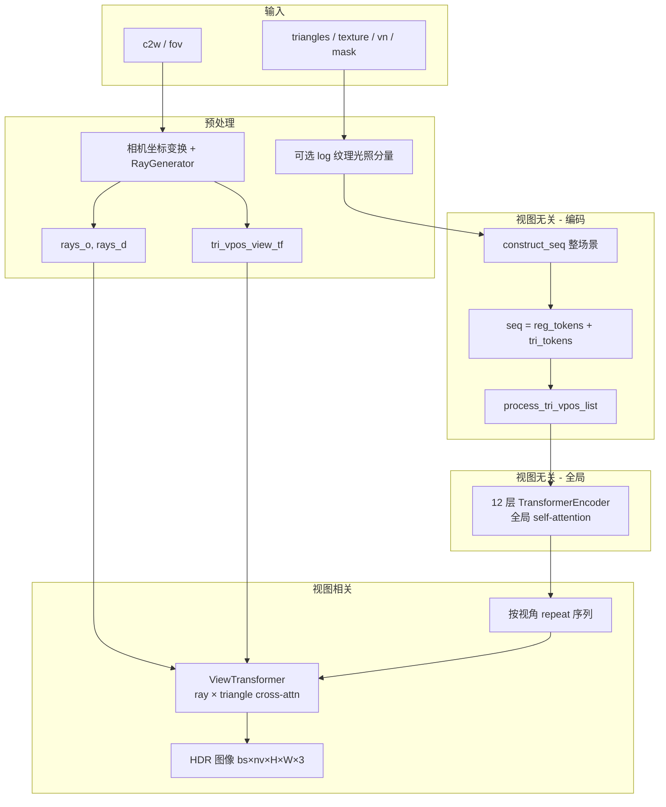
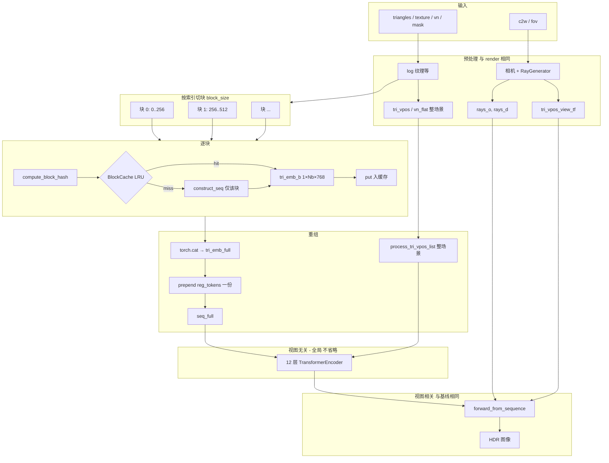
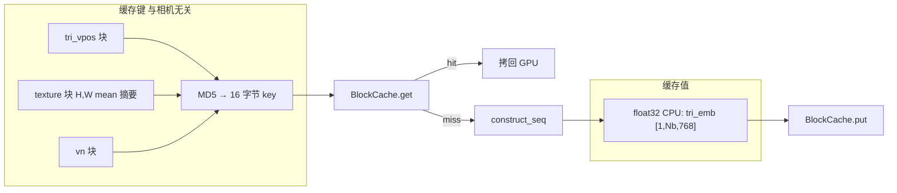
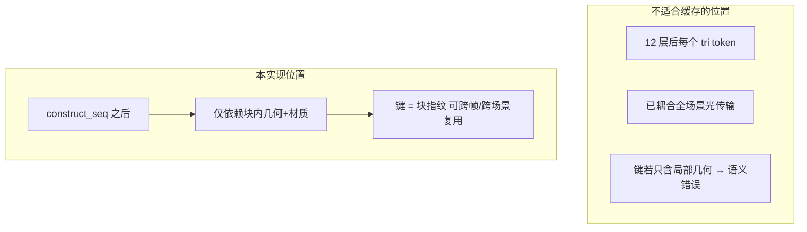
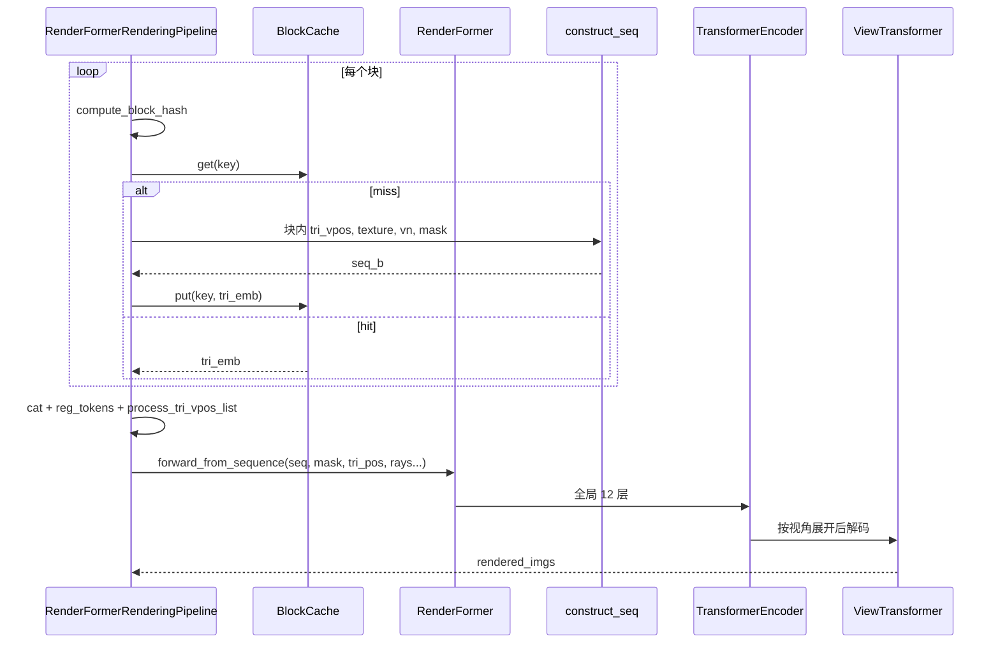
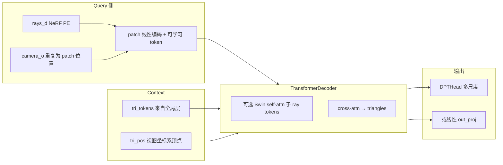

# RenderFormer 本地架构改进说明

**单一入口汇总**（原理 + 数据流 + API + 脚本索引）：[TECHNICAL_DOCUMENT.md](./TECHNICAL_DOCUMENT.md)。

本文档包含两部分：**技术文档（完整文字说明）**与**数据流向图（Mermaid）**。论文级两阶段 Transformer 背景见 [README](../README.md) 与项目页。

**官方示例 H5（cbox-roughness）**：`video-data/teaser-scenes/cbox-roughness`；本仓库常用绝对路径为  
`C:\Users\zhangleipa\.openclaw\workspace\renderformer\video-data\teaser-scenes\cbox-roughness`。  
`batch_infer_with_cache.py`、`batch_infer_temporal_vi.py`、`compare_render_baselines.py`、`experiment_dynamic_scene.py` 的 `--h5_folder` 均可指向该目录。

---

## 1. 改进总览

| 类别 | 内容 | 主要文件 |
|------|------|----------|
| 块级缓存 | 在视图无关 12 层 Transformer **之前**缓存三角形编码，按块哈希复用 | `renderformer/pipelines/rendering_pipeline.py`, `renderformer/cache/` |
| 模型接口 | `forward_from_sequence`：从已拼接序列跑后半段 | `renderformer/models/renderformer.py` |
| 推理脚本 | 单场景多次渲染 / 视频目录逐帧 + 统计 | `infer_with_cache.py`, `batch_infer_with_cache.py` |
| 视图分支 | DPT 解码、可选 Swin self-attention、NeRF/RoPE 等 | `renderformer/models/view_transformer.py`, `renderformer/layers/attention.py` |

更细的缓存原理见 [CACHE_PRINCIPLE_AND_DATAFLOW.md](./CACHE_PRINCIPLE_AND_DATAFLOW.md)，运行说明见 [CACHE_RUN.md](./CACHE_RUN.md)。

---

## 2. 技术文档（完整说明）

### 2.1 背景与目标

RenderFormer（SIGGRAPH 2025）将渲染建模为：**视图无关阶段**（三角形序列上的全局 self-attention，建模场景内光传输）与**视图相关阶段**（光线 patch 与三角形 token 的 cross-attention，输出图像）。

本仓库在官方思路上主要做两类工作：

1. **推理加速**：在**不改变** 12 层全局 Transformer 与视图相关层语义的前提下，对「视图无关层之前」的三角形编码做**块级可复用缓存**，适用于视频逐帧、同场景重复渲染等。
2. **视图 Transformer 与配置**：与 Hugging Face 上 **v1.1-swin-large** 等变体对齐的选项，例如视图分支上的 **Swin 式局部 self-attention**、**DPT 多尺度解码**、**RoPE / NeRF PE** 等（见 `ViewTransformer` 与 `RenderFormerConfig`）。

### 2.2 核心改进：视图无关层「之前」的块级缓存

#### 设计动机

视图无关层输出的是**经全场景 self-attention 耦合后的全局表示**：每个三角形 token 都依赖场景中所有其它三角形。因此：

- **不宜**在 12 层 Transformer **之后**再按「单三角形」或「单块」做跨场景复用：输出已是全局属性，键若只含局部几何则语义错误；键若等价于整场景则无法细粒度失效与跨场景复用。
- **可以**在 **12 层之前**缓存仅依赖**该块局部输入**的量：即 `construct_seq` 得到的**三角形 token（768 维）**，由顶点、法线、纹理 patch 经编码器得到，**与相机无关**。

实现入口：`RenderFormerRenderingPipeline.render_with_block_cache`（`renderformer/pipelines/rendering_pipeline.py`）。

#### 块、键、值

| 概念 | 定义 |
|------|------|
| **块** | 当前按**三角形索引**均匀切分（默认 `block_size=256`），最后一块可不足 `block_size`。可选扩展为按物体 / mesh 分组，便于跨场景复用（见实现计划文档）。 |
| **缓存键** | 块内几何与材质的**指纹**，与相机、视角及其它块无关。输入为 `tri_vpos`、`texture`（哈希时对空间维做 mean 压缩）、`vn`；算法为规范化 float32 字节流后 **MD5 取前 16 字节**（128 bit），见 `renderformer/cache/hash_key.py` 的 `compute_block_hash`。 |
| **缓存值** | 该块在 `construct_seq` 之后、**去掉 register token 段**的三角形嵌入，形状 `[1, N_b, 768]`。CPU 上以 float32 numpy 存储；`BlockCache` 为 **LRU**，可配置 `max_entries` 与可选 `max_memory_mb`（`renderformer/cache/block_cache.py`）。 |

#### 与无缓存路径的等价性

- **无缓存**：整场景一次 `construct_seq` → 一次 `transformer` → `view_transformer`。
- **有缓存**：按块查表；命中则跳过该块的 `construct_seq`，未命中则对该块编码并写入缓存；将各块 `tri_emb` 拼接后，**再 prepend 一整份** `reg_tokens`，对**完整** `tri_vpos` / `mask` 调用 `process_tri_vpos_list`，然后执行**同一条** `transformer` + `view_transformer`（经 `forward_from_sequence`）。

因此：**全局光照与视角相关计算未被省略**；节省的是重复场景或重复块上的 **`construct_seq`（几何+材质编码）**。在相同浮点与 autocast 策略下，与无缓存路径**算法等价**。首帧通常全 miss；同一 H5 第二次渲染或视频后续帧，未变形块可高命中率。

#### 工程边界与实现细节

- **`batch_size > 1`**：当前实现检测到后会**回退**到普通 `render()`，避免多场景键与拼接逻辑混淆。
- **`compute_block_hash` 的 `quantize_bits`**：预留用于量化浮点、抑制噪声导致的假 miss；默认 `0`。
- **miss 路径**：块内 `construct_seq` 在 **fp32 autocast** 下执行；缓存存 float32，命中时再 `.to(device)`，属于数值与稳定性方面的工程取舍。
- **`forward_from_sequence`**：将「编码 / 缓存 / 拼接」与「`construct_seq` 之后的固定后半段」分离，避免重复维护两套 forward 逻辑。

### 2.3 与「训练级块表示」方案的区别

`docs/CACHE_IMPLEMENTATION_PLAN.md` 中讨论了另一路线：将全局 attention 的 token 从「三角形」改为「块表示」并**重新训练**。**当前仓库已落地的是推理等价路径**：全局层仍在**完整三角形序列**上运行，**无需重训**；计划文档里「需改结构 + 训练」的版本与现实现不是同一套方案。

### 2.4 视图相关分支（ViewTransformer）能力

`renderformer/models/view_transformer.py` 与 `renderformer/layers/attention.py` 中的要点包括：

- **位置编码**：`pe_type == 'nerf'` 时对 ray token 与 triangle token 叠加 NeRF 式频域编码；`rope` 时由解码器内 RoPE 处理（`rope_dim` 等与 `RenderFormerConfig` 联动）。
- **射线方向**：`vdir_pe_type == 'nerf'`，对 `rays_d` 做 NeRF 编码后按 patch 展平再线性投影到 latent。
- **解码头**：`use_dpt_decoder` 时使用 **DPTHead**，并从 `out_layers` 指定的层收集多尺度特征；否则使用线性 `out_proj` 直接输出 patch 颜色。
- **Swin self-attention（可选）**：`view_transformer_use_swin_attn` 为真时，在 `TransformerDecoder` 的 ray token 上使用 `SwinSelfAttention`（窗口 mask、与 shift 交替等），与 **microsoft/renderformer-v1.1-swin-large** 等命名一致。

配置项集中在 `RenderFormerConfig`（如 `view_transformer_use_swin_attn`、`dpt_out_layers`、`qk_norm`、`view_indep_qk_norm` 等）。

### 2.5 推理入口与可观测性

| 脚本 | 作用 |
|------|------|
| `infer_with_cache.py` | 同一场景多次渲染，观察第二轮起块缓存命中与 `hit_rate`。 |
| `batch_infer_with_cache.py` | 对整个 H5 视频目录逐帧渲染，可逐帧打印命中统计并在结束汇总。 |

`BlockCache.stats()` 返回 `hits`、`misses`、`size`、`memory_mb`、`hit_rate`，便于调参 `max_cache_entries`、`block_size`。

### 2.6 小结表

| 改进项 | 类型 | 要点 |
|--------|------|------|
| 块级 LRU 缓存 | 推理管线 | 键 = 几何+材质指纹；值 = 视图无关层前的三角 token；全局 Transformer 与视图层不变。 |
| `forward_from_sequence` | 模型 API | 从预组装序列跑后半段，支撑缓存拼接。 |
| `render_with_block_cache` | 流水线 API | 切块、哈希、查缓存、重组、`process_tri_vpos_list`、`forward_from_sequence`。 |
| ViewTransformer + Decoder | 模型/配置 | NeRF/RoPE、DPT、可选 Swin self-attention，与 v1.1 类 checkpoint 对齐。 |

---

## 3. 无缓存路径（基线）数据流

与官方一致：整场景一次编码 → 全局 Transformer → 视图 Transformer。

---

## 4. 块级缓存路径数据流

**原则**：只缓存「块内 `construct_seq` 输出的三角形 token（768 维）」；**不**缓存 12 层 Transformer 输出。重组后仍走**同一套**全局 Transformer + ViewTransformer，故与无缓存路径在算法上等价（浮点策略一致时数值一致）。

### 4.1 块内查表细节（展开）

---

## 5. 为何缓存插在「视图无关层之前」

---

## 6. `forward_from_sequence` 在流程中的位置

将「编码 / 缓存 / 拼接」与「固定后半段」分离：

---

## 7. ViewTransformer 内部概览（配置驱动）

---

## 8. 工程约束（与第 2 节对应）

- **batch_size > 1**：当前 `render_with_block_cache` 回退为普通 `render()`。
- **缓存粒度**：默认按三角形索引均匀分块；可按物体/mesh 分组作为后续扩展。
- **训练级「块表示 + 全局 attention 过块」**：本仓库已实现路径为**推理等价、无需重训**；见第 2.3 节与 [CACHE_IMPLEMENTATION_PLAN.md](./CACHE_IMPLEMENTATION_PLAN.md)。

---

## 9. 相关文档索引

| 文档 | 说明 |
|------|------|
| [TECHNICAL_DOCUMENT.md](./TECHNICAL_DOCUMENT.md) | **汇总技术文档**：原理、数据流、API、脚本与延伸阅读索引 |
| [DESIGN_SPEC_AND_EXPERIMENT.md](./DESIGN_SPEC_AND_EXPERIMENT.md) | 对照架构图：设计说明、实验原理、代码引用、结果模板 |
| [CACHE_PRINCIPLE_AND_DATAFLOW.md](./CACHE_PRINCIPLE_AND_DATAFLOW.md) | 块级缓存原理与逐步数据流（文字版） |
| [CACHE_RUN.md](./CACHE_RUN.md) | 命令行与日志说明 |
| [CACHE_DATAFLOW_BY_EXAMPLE.md](./CACHE_DATAFLOW_BY_EXAMPLE.md) | 示例化数据流 |
| [CACHE_IMPLEMENTATION_PLAN.md](./CACHE_IMPLEMENTATION_PLAN.md) | 含训练级替代方案的讨论 |
| [TEMPORAL_VI.md](./TEMPORAL_VI.md) | 块缓存 + 跨帧近似 VI、`batch_infer_temporal_vi.py`、对比脚本 `compare_render_baselines.py` |
