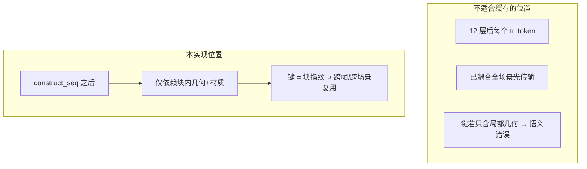
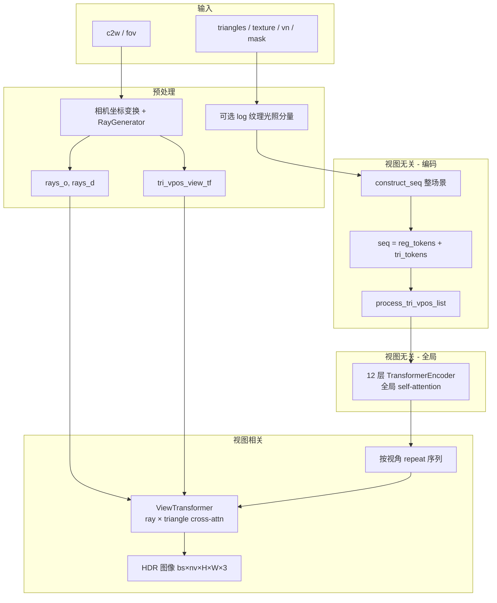
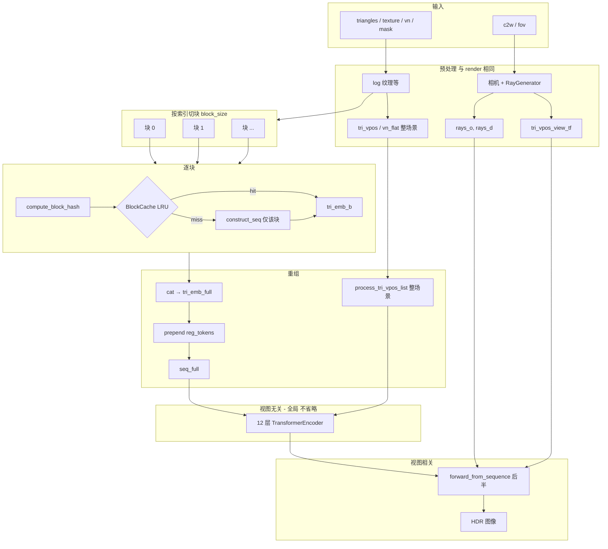
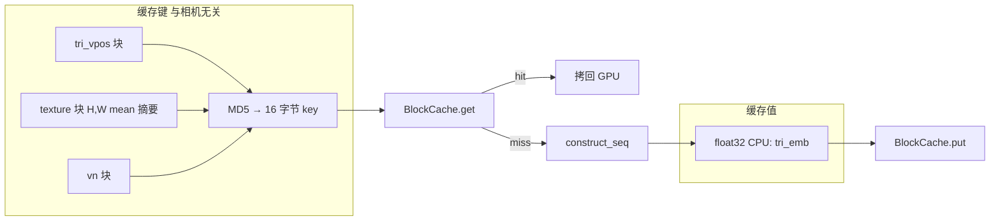
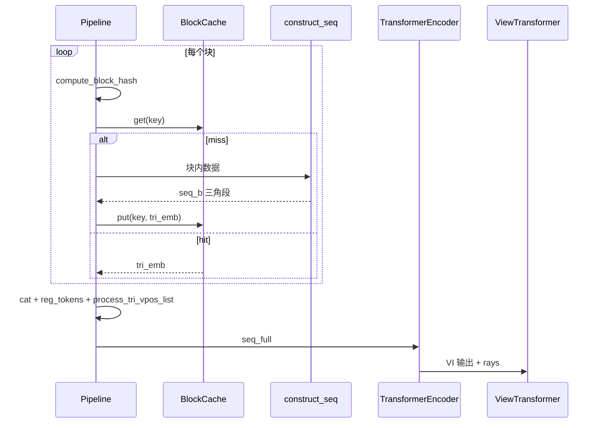
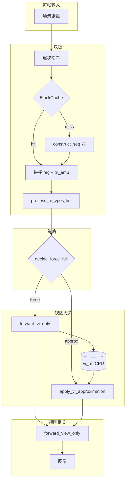

# RenderFormer 推理扩展技术文档

本文档汇总本仓库在**官方 RenderFormer** 之上的推理侧扩展：**块级 construct_seq 缓存**、**跨帧近似 VI（Temporal VI）**、**模型 API 拆分**及配套脚本与实验方法。论文级两阶段架构与安装说明见仓库根目录 [README](../README.md)。

---

## 1. 文档范围与符号约定

| 符号 | 含义 |
|------|------|
| **VI** | View-Independent，视图无关阶段：12 层 `TransformerEncoder`，全局三角形 self-attention |
| **View** | 视图相关阶段：`ViewTransformer`，光线 patch 与三角形 token 的 cross-attention，输出 HDR 图像 |
| **construct_seq** | 将顶点/法线/纹理 patch 编码为三角形 token（768 维）+ 与 `reg_tokens` 拼接前的逻辑 |
| **① / ② / ③** | 对比脚本中：① `pipeline.render`（原始）；② `render_with_block_cache`；③ `render_with_temporal_vi` |

---

## 2. 官方基线管线（原理摘要）

RenderFormer（SIGGRAPH 2025）将渲染建模为两阶段：

1. **视图无关**：对每个三角形构造 token，经 **12 层全局 self-attention**，得到耦合全场景光传输的表示。
2. **视图相关**：对每个相机视角，将 VI 输出与射线编码一起做 **Transformer 解码**，输出图像。

官方入口一般为 `RenderFormerRenderingPipeline.render()` → `RenderFormer.forward()`：整场景一次 `construct_seq` → `transformer` → 按视角展开 → `view_transformer`。

---

## 3. 本仓库扩展总览

| 模块 | 作用 | 核心代码位置 |
|------|------|----------------|
| 块级缓存 | VI **之前**按块复用 `construct_seq` 的三角形嵌入 | `renderformer/cache/`，`render_with_block_cache` |
| 模型 API | 支持「预拼序列」「只跑 VI」「只跑 View」 | `renderformer/models/renderformer.py` |
| Temporal VI | 跨帧在「全算 VI」与「近似 VI」间调度，再跑 View | `renderformer/temporal_vi/`，`render_with_temporal_vi` |
| 视图分支配置 | DPT、Swin self-attention、NeRF/RoPE 等与 v1.1 权重对齐 | `view_transformer.py`，`attention.py`，`config.py` |

**与训练级「块 token + 改全局 attention」方案的区别**：当前落地为**推理等价**路径——全局 attention 仍在**完整三角形序列**上执行，**无需重训**。见 [CACHE_IMPLEMENTATION_PLAN.md](./CACHE_IMPLEMENTATION_PLAN.md) 中的讨论。

---

## 4. 示例数据路径（官方 cbox-roughness）

| 写法 | 路径 |
|------|------|
| 相对仓库根目录 | `video-data/teaser-scenes/cbox-roughness` |
| 典型 Windows 工作区绝对路径 | `C:\Users\zhangleipa\.openclaw\workspace\renderformer\video-data\teaser-scenes\cbox-roughness` |

数据下载：README 与 `download_video_data.sh` / Hugging Face 数据集说明。

---

## 5. 块级缓存：技术原理

### 5.1 为何插在 VI（12 层 Transformer）**之前**

VI 输出中每个三角形 token 已与**全场景**交互，是**全局属性**。若在 VI **之后**按块/按三角缓存：

- 键若只含局部几何 → **语义错误**（同一三角在不同邻居下 VI 输出不同）。
- 键若等价整场景 → **无法**细粒度失效与跨场景复用同一块。

若在 VI **之前**缓存：值仅为 **`construct_seq` 输出的、只依赖本块几何+材质的嵌入**，与相机无关，可用**块指纹**做 key，跨帧/跨场景复用；全局光传输仍在后续 12 层中计算。

### 5.2 块、键、值

| 概念 | 说明 |
|------|------|
| **块** | 默认按三角形**索引**均匀切分，`block_size`（如 256）；末块可不足。 |
| **键** | `tri_vpos`、`texture`（5D 时在 H、W 上 **mean** 再参与哈希）、`vn` → float32 字节流 → **MD5 前 16 字节**。与相机无关。 |
| **值** | 该块 `construct_seq` 输出中**三角形段** `[1, N_b, 768]`（不含 `reg_tokens`）；CPU **float32** numpy，`BlockCache` **LRU**。 |

### 5.3 算法等价性（与官方整段 `render`）

- **无缓存**：整场景 `construct_seq` → `transformer` → `view_transformer`。
- **有缓存**：逐块取嵌入 → **拼接** → **一份** `reg_tokens` 置于序列首 → `process_tri_vpos_list`（整场景 RoPE/mask）→ **同一** `transformer` + **同一** View 路径（经 `forward_from_sequence`）。

因此：**不省略** VI 与 View；仅可能跳过部分 **`construct_seq`**。在相同数值策略下与无缓存**算法等价**。

### 5.4 命中时实际省去什么

命中**不**包含任何 **Transformer** 计算；省去的是该块上的 **`construct_seq`**（线性层、纹理/顶点/法线编码等）。若总时间主要由 VI（\(O(N^2)\) attention）与 View 主导，**整体加速可能不明显甚至为负**（块循环、哈希、CPU↔GPU、多段 kernel 的开销）。详见实测对比脚本讨论。

### 5.5 工程约束

- `batch_size > 1`：当前回退为普通 `render()`。
- `compute_block_hash` 支持可选 `quantize_bits` 抑制浮点噪声导致的假 miss。
- 块内 miss 路径常用 **fp32 autocast** 做 `construct_seq`，与全链路 **fp16** 混用时可能与纯 `render` 有细微数值差。

---

## 6. 数据流图：基线与块缓存

### 6.1 无缓存基线（与官方一致）

### 6.2 块级缓存路径

### 6.3 块内哈希与查表

### 6.4 块缓存与后半段衔接（时序）

---

## 7. 模型 API（`RenderFormer`）

| 方法 | 作用 |
|------|------|
| `forward(...)` | 官方路径：construct_seq → transformer → view |
| `forward_from_sequence(seq, mask, tri_pos, rays...)` | 已拼好 `seq` 时，从 VI 起跑到输出 |
| `forward_vi_only(seq, mask, tri_pos)` | 仅 12 层 Encoder |
| `forward_view_only(seq_after_vi, ...)` | 给定 VI 输出，仅 View 分支 |

Temporal VI 与 Profiling 依赖 **VI / View 拆分**。

---

## 8. Temporal VI：技术原理

### 8.1 目标与与块缓存的关系

在**块缓存拼好 `seq_full` 之后**，根据策略选择：

- **全算**：`forward_vi_only` → 更新 CPU 上的 **`vi_ref`**（VI 输出 numpy）。
- **近似**：不跑 VI，用 **`vi_ref`** 或 **`level1` 混合**（当前 `seq` 经 LayerNorm 与 `vi_ref` 线性混合）作为 VI 输出，再 **`forward_view_only`**。

| 层级 | 块缓存 | Temporal VI |
|------|--------|-------------|
| 节省的主要计算 | `construct_seq`（无 Transformer） | **整段 VI（12 层）**（近似帧） |
| 判据 | 块哈希 | 周期 K、块变化率、连续近似上限、冷启动等 |

二者**叠加**：近似帧仍可命中块缓存以拼 `seq_curr`。

**注意**：近似帧与全算帧**数学上不等价**；静态几何下 `level0` 复用 `vi_ref` 可能与全算 VI 一致，动态场景会出现滞后与误差。

### 8.2 强制全算触发（逻辑或）

含：`cold_start`、`tri_count_change`、`seq_len_mismatch`、`block_count_change`、`block_change_ratio`（可选）、`periodic_k`（`full_every_k > 0`）、`max_consecutive_approx` 等。详见 `renderformer/temporal_vi/policy.py` 与 [TEMPORAL_VI.md](./TEMPORAL_VI.md)。

### 8.3 数据流（块缓存 + Temporal）

---

## 9. 脚本与实验工具

| 脚本 | 用途 |
|------|------|
| `infer_with_cache.py` | 单 H5 多次渲染，观察块缓存命中 |
| `batch_infer_with_cache.py` | 目录逐帧 + 块缓存统计 + 可选视频 |
| `batch_infer_temporal_vi.py` | 目录逐帧 + Temporal VI + 统计 |
| `compare_render_baselines.py` | ①②③ 耗时与相对 ① 的图像误差对比 |
| `experiment_dynamic_scene.py` | 动态序列或合成扰动，导出 ①②③ PNG/EXR 与横向拼接图 |

命令行参数细节见各文件 `--help` 及 [CACHE_RUN.md](./CACHE_RUN.md)、[TEMPORAL_VI.md](./TEMPORAL_VI.md)。

**对比实验注意**：`compare_render_baselines.py` 中 **BC 与 TV 使用两套独立 `BlockCache`**，避免同帧内 TV 蹭 BC 的命中，计时更可分。

---

## 10. ViewTransformer 与配置（摘要）

- **PE**：`nerf` / `rope`；射线方向 NeRF 编码；可选 **Swin** 式 ray token self-attention（`view_transformer_use_swin_attn`）。
- **解码**：`DPTHead` 多尺度或线性 `out_proj`。
- 配置类：`RenderFormerConfig`（`renderformer/models/config.py`）。

---

## 11. 延伸阅读（分文档）

| 文档 | 内容 |
|------|------|
| [DESIGN_SPEC_AND_EXPERIMENT.md](./DESIGN_SPEC_AND_EXPERIMENT.md) | **设计思路、实验原理、关键代码分块引用、实验目的与结果模板** |
| [ARCHITECTURE_IMPROVEMENTS.md](./ARCHITECTURE_IMPROVEMENTS.md) | 改进说明 + 更完整的 Mermaid 图集 |
| [CACHE_PRINCIPLE_AND_DATAFLOW.md](./CACHE_PRINCIPLE_AND_DATAFLOW.md) | 块缓存原理与 ASCII 逐步数据流 |
| [CACHE_RUN.md](./CACHE_RUN.md) | 块缓存脚本运行说明 |
| [CACHE_DATAFLOW_BY_EXAMPLE.md](./CACHE_DATAFLOW_BY_EXAMPLE.md) | 结合 cbox-roughness 的示例数据流 |
| [CACHE_IMPLEMENTATION_PLAN.md](./CACHE_IMPLEMENTATION_PLAN.md) | 含训练级替代路线讨论 |
| [TEMPORAL_VI.md](./TEMPORAL_VI.md) | Temporal VI 参数表与实验脚本索引 |

---

## 12. 修订说明

本文档为**汇总入口**：细节公式、参数默认值以源码与分文档为准；更新扩展时可先改实现再同步本节与 [ARCHITECTURE_IMPROVEMENTS.md](./ARCHITECTURE_IMPROVEMENTS.md) 中的索引。
