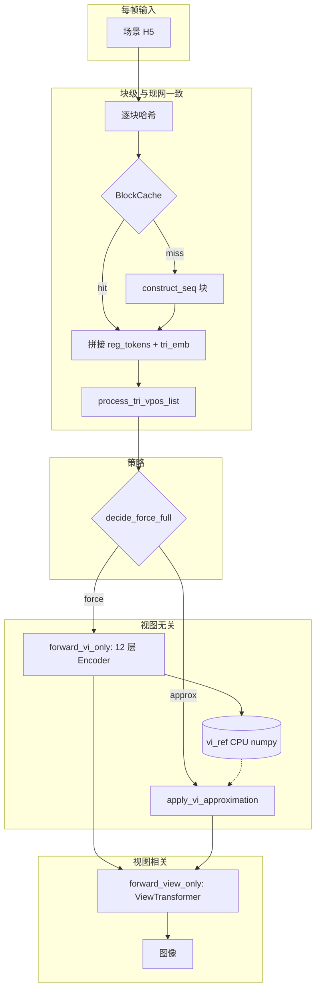

# 块缓存 + 跨帧近似 VI（Temporal VI）

> **汇总说明**见 [TECHNICAL_DOCUMENT.md](./TECHNICAL_DOCUMENT.md)。

本方案在现有**块级 construct_seq 缓存**之上，增加**视图无关（VI）12 层 Transformer**的跨帧调度：多数帧可**近似复用**上次全算结果，在**周期到达**或**阈值触发**时**强制全算**，再进入 View 分支。  
**近似帧与全算帧在数学上不等价**，需按场景调参并观察画质。

### 示例 H5：官方 cbox-roughness

下载官方视频数据后（README / `download_video_data.sh`），可直接用 **Cornell Box 粗糙度动画** 序列做实验：

| 写法 | 路径 |
|------|------|
| 相对仓库根目录 | `video-data/teaser-scenes/cbox-roughness` |
| 本工作区（Windows 绝对路径） | `C:\Users\zhangleipa\.openclaw\workspace\renderformer\video-data\teaser-scenes\cbox-roughness` |

下文命令中的 `--h5_folder` 在终端里可先 `cd` 到仓库根，用相对路径；或在 PowerShell 里把 `--h5_folder` 设为上述绝对路径。

---

## 1. 与块缓存的关系

| 层级 | 块缓存 | Temporal VI |
|------|--------|-------------|
| 作用 | 跳过未变三角形的 `construct_seq` | 跳过（或混合）整段 **VI Transformer** |
| 键/条件 | 块几何+材质哈希 | 帧序号、块变化率、连续近似上限等 |

二者**叠加**：全算帧与近似帧都会先拼 `seq_full`，其中未变块仍可命中块缓存。

---

## 2. 数据流



### 2.1 近似模式

- **level0**：`seq_vi = vi_ref`（直接复用上次全算 VI 输出）。适合**准静态几何**、主要动相机。
- **level1**：`seq_vi = α · LayerNorm(seq_curr) + (1−α) · vi_ref`（在 float32 域混合后再 cast）。`seq_curr` 为当前帧拼接序列（与进 VI 前一致），略拉近局部编码与旧全局 VI。

---

## 3. 强制全算触发条件（OR）

满足**任一**即本帧执行完整 `forward_vi_only`：

| 条件 | 说明 |
|------|------|
| `cold_start` | 尚无 `vi_ref`（首帧或已清空） |
| `tri_count_change` | `triangles.shape[1]` 与上一帧不同 |
| `seq_len_mismatch` | `vi_ref` 序列长度与当前 `seq_full` 不一致 |
| `block_count_change` | 块数量变化 |
| `block_change_ratio` | 启用时：块哈希相对上一帧变化比例 > 阈值 |
| `periodic_k` | `full_every_k > 0` 且距上次全算已满 K 个已完成帧 |
| `max_consecutive_approx` | 连续近似帧数 ≥ 配置上限 |
| `approx_ok` | 不强制，走近似（不计入 `force_reason_hist`） |

---

## 4. API

### 4.1 `RenderFormer`

- `forward_vi_only(seq, valid_mask_padded, tri_vpos_list)` → VI 后 token  
- `forward_view_only(seq_after_vi, ...)` → 与 `forward_from_sequence` 后半段一致  

### 4.2 `RenderFormerRenderingPipeline.render_with_temporal_vi(...)`

参数要点：`block_cache`、`temporal_state`（**跨帧复用同一实例**）、`temporal_cfg`。  
返回 `(rendered_imgs, frame_log)`，`frame_log` 含 `vi_path`、`force_full`、`force_reason`、`block_hit_rate` 等。

### 4.3 状态 `TemporalVIState`

跨帧保持：`vi_ref_np`、`last_block_keys`、`num_tris`、`frame_index`、`last_full_frame`、`consecutive_approx`、`cumulative`、`force_reason_hist`。  
新序列开始前可 `TemporalVIState()` 重置。

---

## 5. 启动脚本与参数：`batch_infer_temporal_vi.py`

```bash
python batch_infer_temporal_vi.py \
  --h5_folder video-data/teaser-scenes/cbox-roughness \
  --output_dir output/videos/cbox-temporal \
  --full_every_k 8 \
  --max_consecutive_approx 32 \
  --approx_mode level0 \
  --block_size 256 \
  --max_cache_entries 50000
```

### 5.1 常用参数

| 参数 | 默认 | 说明 |
|------|------|------|
| `--h5_folder` | 必填 | 含多帧 `*.h5` 的目录 |
| `--output_dir` | 与 h5 目录相同 | PNG/EXR/可选 video.mp4 |
| `--model_id` | `microsoft/renderformer-v1.1-swin-large` | 与 `infer.py` 一致 |
| `--precision` | fp16 | bf16 / fp16 / fp32 |
| `--resolution` | 512 | 渲染边长 |
| `--block_size` | 256 | 块缓存粒度 |
| `--max_cache_entries` | 50000 | LRU 上限 |
| `--full_every_k` | 8 | 每 K 帧强制全算 VI；**0** = 不按周期 |
| `--max_consecutive_approx` | 32 | 连续近似上限 |
| `--changed_block_ratio_threshold` | 不设置=关闭 | 例：`0.01` 表示变化块比例 >1% 则全算 |
| `--approx_mode` | level0 | `level0` / `level1` |
| `--blend_alpha` | 0.15 | level1 的 α |
| `--quiet` | - | 减少逐帧打印 |
| `--save_video` | 默认开启 | 写 `video.mp4` |

### 5.2 控制台输出

- 每帧（非 quiet）：`vi_path`（full/approx）、`force`、`reason`、块命中率、当前 `consecutive_approx`。  
- 结束：**VI 全算/近似次数**、块缓存汇总、`force_reason_hist`、`TemporalVIState.summary()`。

---

## 6. 与精确推理的对照

- **仅块缓存**（`batch_infer_with_cache.py`）：与官方逐帧全算**等价**（浮点策略一致时）。  
- **本脚本**：近似帧**不重跑 VI**，可能产生时序误差；适合**换时间换算力**的预览或视频，重要帧可调小 `full_every_k` 或关闭近似（将 `full_every_k` 设为 **1** 即每帧全算 VI，仅保留块缓存收益）。

---

## 7. 对比实验脚本：`compare_render_baselines.py`

在同一批数据上**逐帧**依次执行：

1. **baseline**：`pipeline.render()`（与官方 `infer.py` / `batch_infer.py` 同路径，无块缓存、无 VI 近似）  
2. **block_cache**：`render_with_block_cache`（与 baseline 应数值接近）  
3. **temporal_vi**：`render_with_temporal_vi`（近似帧会偏离 baseline）

输出：**逐帧**打印 ①②③ 耗时、相对 ① 的**省时比例与加速比**、②③ 相对 ① 的 **RMSE / rel_RMSE% / max|diff|**；末尾三组汇总：**耗时对比**（总计、均帧、占 baseline%、加速）、**图像误差表**（含仅 approx 帧子统计）、**VI 调度与双 LRU 缓存**。  
块缓存使用 **两套独立 LRU**（BC 与 TV 各一套），避免同帧内蹭命中。

```bash
# 视频目录前 16 帧
python compare_render_baselines.py --h5_folder video-data/teaser-scenes/cbox-roughness --max_frames 16

# 单 H5 重复 N 次（模拟多帧同场景，观察 temporal + 块缓存）
python compare_render_baselines.py --h5_file tmp/cbox/cbox.h5 --runs 5 --full_every_k 4
```

常用参数与 `batch_infer_temporal_vi.py` 对齐：`--full_every_k`、`--approx_mode`、`--block_size`、`--precision` 等。

---

## 8. 动态场景实验：`experiment_dynamic_scene.py`

对 **① baseline / ② block_cache / ③ temporal_vi** 逐帧渲染并**导出图像**，用于观察动态几何或材质下的差异。

- **文件夹模式**（`--h5_folder`）：每帧一个 H5，视为真实动态序列；`--perturb` 无效。
- **合成模式**（`--h5_file`）：单场景起点，每帧在上一帧基础上**累积**扰动（`vertex_noise` / `global_translate` / `sliding_block` / `texture_jitter` / `combo`）。

输出目录：

- `*_01_baseline.png`、`*_02_block_cache.png`、`*_03_temporal_vi.png`（及对应 `.exr`）
- `*_00_compare_row.png`：横向拼接 ①②③（左→右）
- `experiment_meta.json`、`per_frame_metrics.jsonl`（每帧 `vi_path`、`force_reason`、相对 baseline 的 MSE 等）

```bash
python experiment_dynamic_scene.py --h5_folder video-data/teaser-scenes/cbox-roughness --max_frames 12 --output_dir output/exp_dyn_real
python experiment_dynamic_scene.py --h5_file tmp/cbox/cbox.h5 --num_frames 24 --perturb sliding_block --output_dir output/exp_dyn_syn
```

---

## 9. 相关文档

- [ARCHITECTURE_IMPROVEMENTS.md](./ARCHITECTURE_IMPROVEMENTS.md) — 块缓存与整体改进索引  
- [CACHE_PRINCIPLE_AND_DATAFLOW.md](./CACHE_PRINCIPLE_AND_DATAFLOW.md) — 块缓存原理  
- [CACHE_RUN.md](./CACHE_RUN.md) — 块缓存脚本说明  
- [compare_render_baselines.py](../compare_render_baselines.py) — 静态/序列耗时与数值对比  
