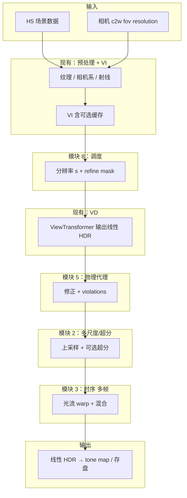
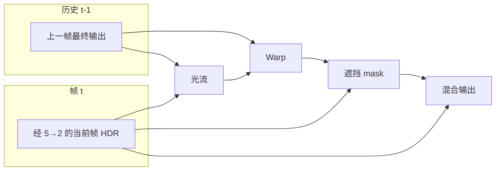
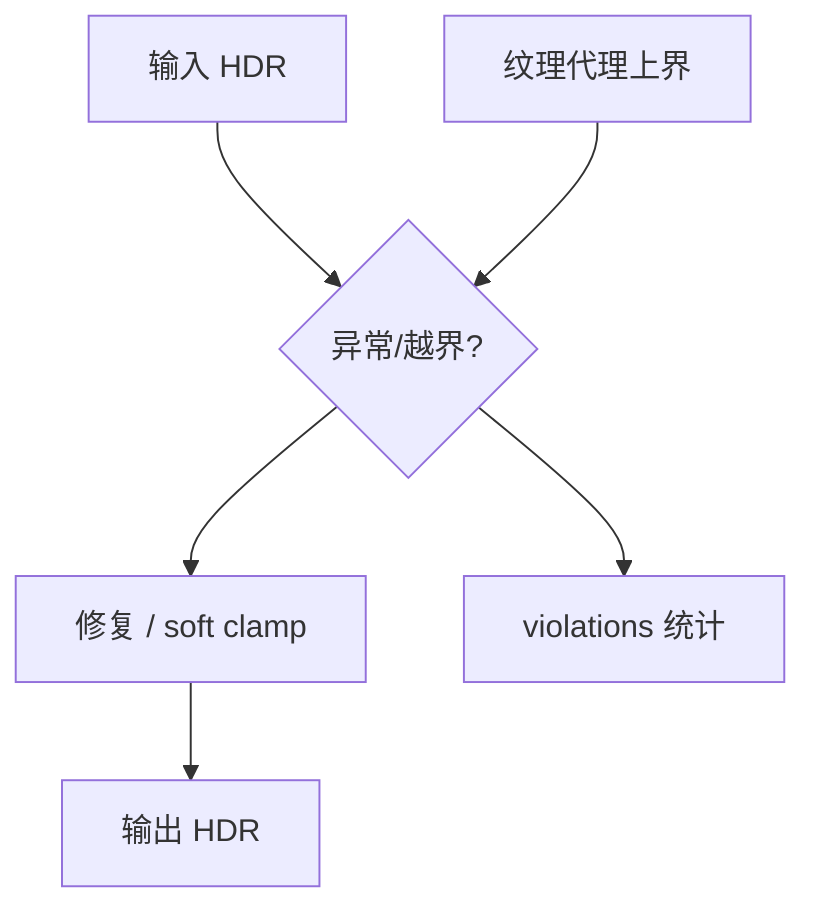
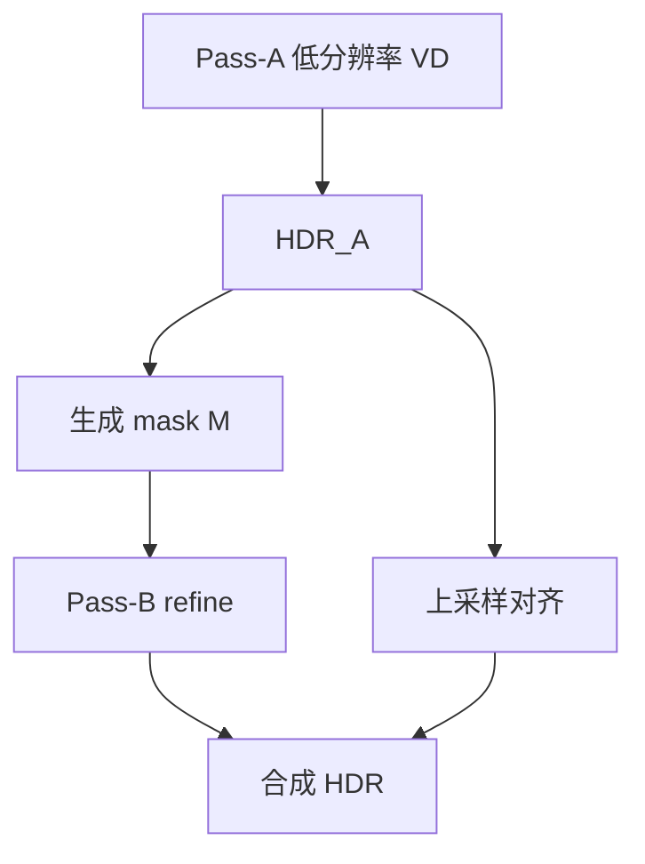

# 设计文档：项目 C — 质量可控的神经 GI（物理先验 + 高分辨率）

> 版本：1.0  
> 状态：设计已落档；具体代码模块可按里程碑逐步实现。  
> 关联仓库：`cacheFormer`（基于 RenderFormer 推理管线扩展）。

---

## 1. 背景与目标

### 1.1 背景

当前仓库以 **RenderFormer** 为核心：从 HDF5 读取三角网格与材质，经 **视图无关（VI）** 与 **视图相关（VD）** 两阶段得到**场景线性 HDR**，再可选色调映射与落盘。已有 **VI 缓存**等同场景加速能力。

神经渲染在观感上常见三类问题：

1. **辐射度与数值**：极端高亮、非有限值、暗部不合理抬升等。  
2. **弱物理一致性**：无显式 BRDF 时，仍希望对「明显越界」行为可度量、可修正。  
3. **分辨率与时间**：高分辨率推高 VD 成本；视频逐帧处理易产生闪烁。

### 1.2 项目 C 目标（一句话）

在**不修改官方预训练 VI 权重**的前提下，增加一条**可解释、可度量、可开关**的质量控制链：**自适应算力调度（8）→ 多尺度与高分辨率（2）→ 推理侧物理代理与修正（5）→ 时域稳定（3）**，并配套评测与配置。

### 1.3 范围与非目标

**纳入范围**

| 代号 | 模块 | 说明 |
|------|------|------|
| 5 | 物理代理与推理侧修正 | 有界性、软上界、违反率统计；远期可接训练侧软约束 |
| 2 | 多尺度 / 超分 | 低分辨率 VD + 上采样 + 可选轻量超分网络 |
| 3 | 时域一致性 | 光流 warp + 遮挡感知混合；与场景切换检测 |
| 8 | 自适应射线/分辨率调度 | 粗 VD + 重要性 mask + 可选 refine pass |

**非目标（首期）**

- 不承诺实现完整可微路径追踪对齐。  
- 不将「修改官方 VI 训练」列为首期交付（可作为二期课题）。

---

## 2. 与现有管线的关系

### 2.1 现有数据流（摘要）

1. `scene_processor`：JSON → HDF5（`triangles`, `texture`, `vn`, `c2w`, `fov` 等）。  
2. `RenderFormerRenderingPipeline`：预处理（纹理、相机系、射线）→ 可选 `ViewIndependentCache` → `RenderFormer`（VI + VD）→ 维度置换与非 LDR 的 HDR 还原。  
3. `infer.py` / `batch_infer.py`：加载 H5、调用管线、存图/视频/性能 JSON。

### 2.2 项目 C 插入位置（原则）

- **模块 8**：位于 **VD 调用策略层**（改变分辨率、次数或局部计算），**之下**仍使用现有 `RenderFormer` / `RenderFormerRenderingPipeline` 的 VI/VD 逻辑。  
- **模块 5、2、3**：位于 **VD 已输出线性 HDR 之后**、**用户 tone map / 写盘之前**（顺序默认：**8 → VD → 5 → 2 → 3**；其中 3 仅多帧；5→3 顺序可做消融，默认先校正再时序混合）。

**与 VI 缓存**：VI 缓存逻辑不变；模块 C 主要包裹 **VD 输出之后** 与 **VD 调度之前**。

---

## 3. 分模块技术原理

### 3.1 模块 5 — 物理代理与推理侧修正

**思路**：不用完整物理引擎，定义**可计算**的代理量与**闭式**修正。

1. **有界性与有效值**  
   - 处理非正、NaN、Inf：邻域或 ε 修复。  
   - **软上界**：由纹理中与发射/反照率相关的通道统计得到 \(L_{\text{soft}}\)（具体通道与 `RenderFormerConfig` 中纹理通道定义一致，实现时以配置为准）。  
   - **smooth clamp**：避免硬切导致 banding。

2. **高光区域加强约束（可选弱代理）**  
   - 高图像梯度 + 高亮度区域施加更紧的软上界（不等价于严格 Fresnel，仅作工程可控性）。

3. **违反度量（交付指标）**  
   - 输出 `violations` 字典（如 `viol_nonneg`、`viol_energy` 等）写入日志或 JSON，便于回归与论文图表。

### 3.2 模块 2 — 多尺度与高分辨率

**思路**：先在较低空间分辨率完成 VD（或与 8 的 Pass-A 共用），再上采样，可选**轻量超分**恢复高频。

- **HDR 域**：建议在固定流程下使用 `log1p` 等稳定域做学习型超分，输出回到线性 HDR。  
- **Tiling（可选）**：与 8 的局部 refine 可合并规划，注意接缝与亮度一致。

### 3.3 模块 3 — 时域一致性

**思路**：对校正后 HDR 估计光流，将上一帧输出 warp 到当前，用**遮挡/不可靠 mask** 在「当前帧」与「warp 历史」之间混合。

- **场景切换**：`scene_fingerprint` 变化或新 clip 标记时清空历史，避免错误混合。  
- **首帧**：无历史，直接输出经 5、2 后的结果。

### 3.4 模块 8 — 自适应射线/分辨率调度

**思路**：

1. **Pass-A**：在缩放分辨率 \(sH \times sW\)（如 \(s=0.5\)）上执行 VD，得到 \( \text{HDR}_A \)。  
2. **重要性图**：由 \( \text{HDR}_A \) 的梯度、局部方差等生成 mask \(M\)。  
3. **Pass-B（可选）**：对 \(M\) 区域做全分辨率 refine（实现上若 API 仅支持整图 VD，一期可采用「第二次全分辨率全图 + 按 \(M\) 混合」的退化方案，再迭代真 sparse）。

**与模块 2 分工**：**8 决定哪里多算**；**2 决定如何从低分辨率变清晰**。

---

## 4. 数据流图

### 4.1 系统总览（单帧，含规划中的 QC 链）

### 4.2 多帧时序（模块 3）

### 4.3 模块 5 内部逻辑（概念）

### 4.4 模块 8 与两次 VD（概念）

---

## 5. 建议的软件结构（规划）

以下路径为**建议**，实现时可微调命名，但建议在文档中保持「职责」一致。

| 路径 | 职责 |
|------|------|
| `renderformer/pipelines/quality_controlled_pipeline.py` | 编排 8→VD→5→2→3，读取 `QCConfig` |
| `renderformer/post/physics_proxy.py` | 模块 5 |
| `renderformer/post/super_resolution.py` | 模块 2 |
| `renderformer/post/temporal_stabilizer.py` | 模块 3 |
| `renderformer/post/adaptive_schedule.py` | 模块 8 |
| `renderformer/post/qc_config.py` | dataclass / YAML 映射 |
| `infer_qc.py` 或扩展 `batch_infer.py` | CLI 与 `--qc-config` |
| `benchmark_qc.py` | 违反率、视频指标、对比 baseline |

**包导出**：可在 `renderformer/__init__.py` 中按需导出 `QualityControlledRenderingPipeline`（名称以最终实现为准）。

---

## 6. 分阶段里程碑（参考）

| 阶段 | 内容 | 交付 |
|------|------|------|
| M0 | 接口与配置 schema、violations 字段定义 | 设计评审通过 |
| M1 | 模块 5 规则版 + 测试 + 批处理报告 | JSON 违反率 |
| M2 | 模块 2：低分 VD + 上采样 + 可选超分占位 | 速度–质量曲线 |
| M3 | 模块 8：两 pass + mask 与 M2 联调 | 稳定端到端 |
| M4 | 模块 3：光流 + 混合 + 场景切换 | 视频 demo + tLP 等 |
| M5 | 与参考渲染或固定测试集评测 | 报告与回归集 |
| M6（可选） | 训练侧软约束 / 更强物理代理 | 独立分支 |

---

## 7. 风险与验收要点

| 风险 | 缓解 |
|------|------|
| 模块 5 压平高光 | 仅超标区域 soft clamp；参数可配置；保留 raw 对比输出 |
| 模块 3 拖影 | 遮挡 mask；大运动 fallback |
| 模块 8 更慢 | 默认关闭；仅当 refine 比例低于阈值时启用 |
| 模块 2 HDR 发糊 | log 域与高光加权训练（训练阶段） |

**验收**：违反率下降、与全分辨率单 pass 的 PSNR/LPIPS、视频 tLP 或自建 flicker 指标、主观对比表。

---

## 8. 修订记录

| 日期 | 版本 | 说明 |
|------|------|------|
| 2026-05-12 | 1.0 | 初稿：项目 C 完整设计落档 |
