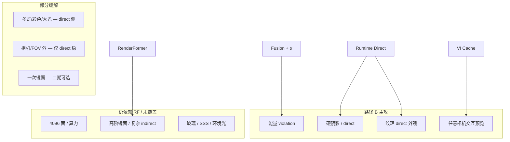
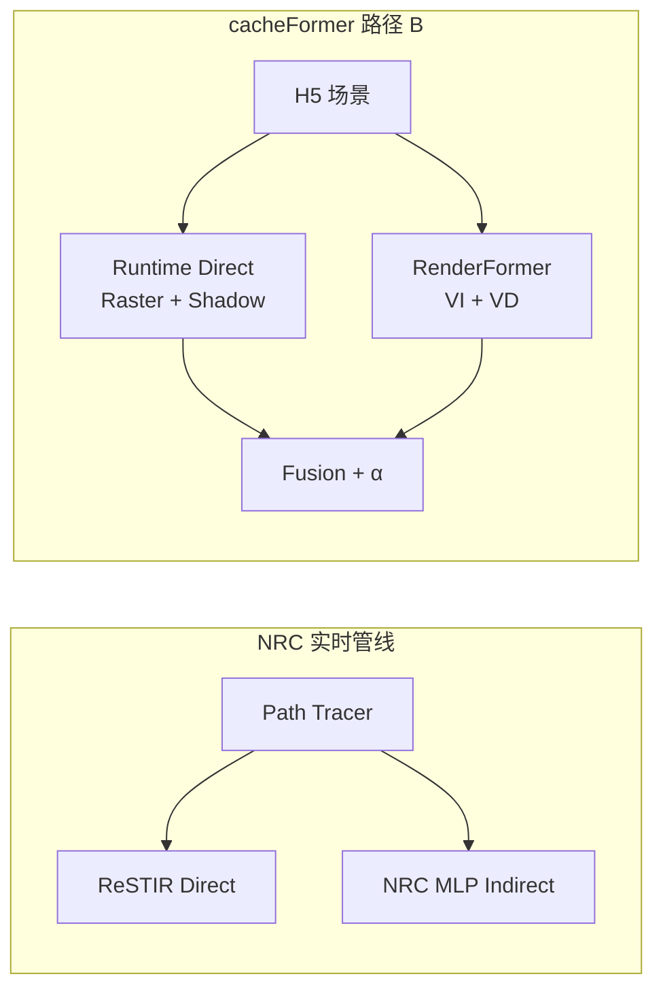
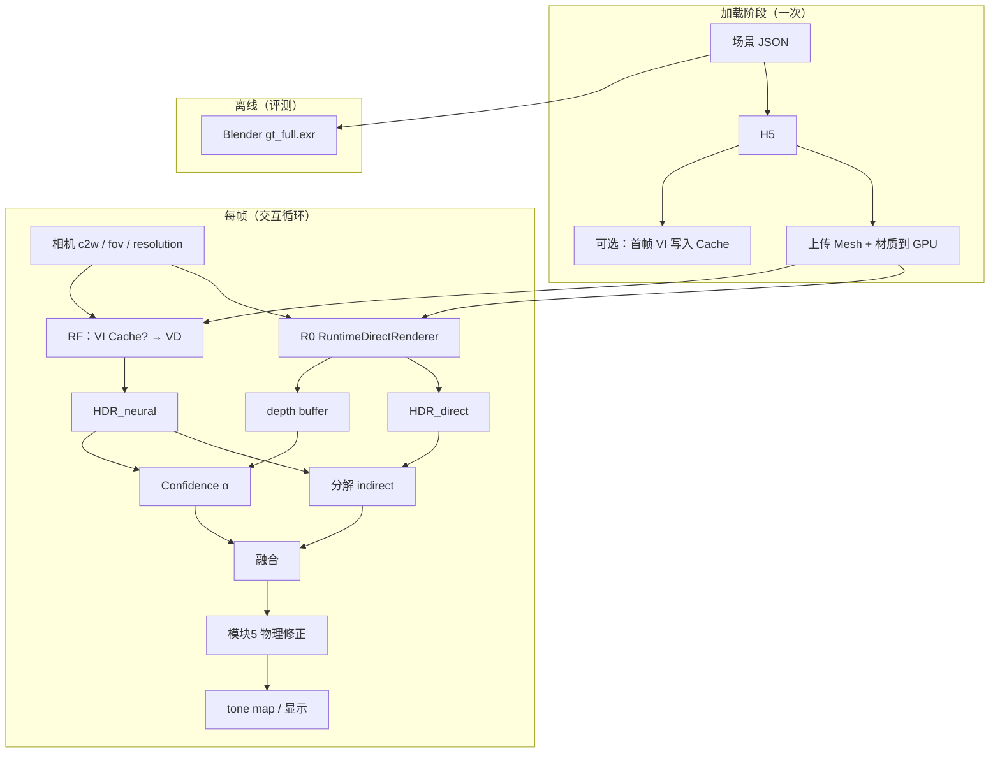
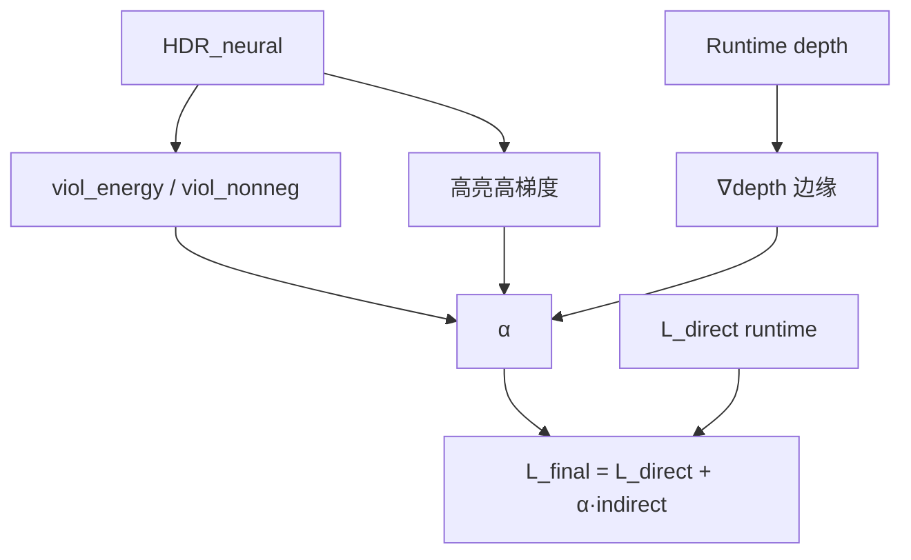
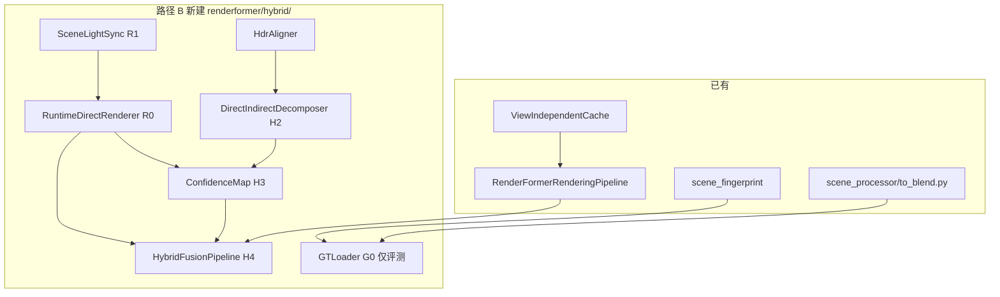

# 方案四施行计划：Confidence-Aware Hybrid Neural–Classical GI（路径 B）

> **版本**：2.0（路径 B 为主路线）  
> **状态**：计划已落档；代码模块按里程碑逐步实现。  
> **关联仓库**：`cacheFormer`（基于 RenderFormer 推理管线扩展）。  
> **配套阅读**：[相关论文解析与下载索引](./scheme4_paper_reading_guide.md)  
> **关联设计**：[项目 C — 质量可控的神经 GI](./project_c_quality_controlled_neural_gi.md)（模块 5 为 confidence 输入源）

---

## 0. 路径选型说明

| 路径 | Direct 来源 | 相机 | 实时/交互 | 本文档地位 |
|------|-------------|------|-----------|------------|
| **路径 A** | 离线 Blender EXR，运行时查表 | 需预渲或插值 | 准实时（固定轨迹） | **评测基线 / ablation** |
| **路径 B** | **运行时 Raster 或轻量 RT** | **任意连续相机** | **交互预览优先** | **主实施路线（默认）** |

> **路径 B 一句话**：对标 NRC 的「ReSTIR 管 direct、NRC 管 indirect」——改为 **Raster/RT 管 direct、RenderFormer 管 indirect**，融合与 confidence 逻辑不变；Blender **仅离线 GT**，不进运行时。

---

## 1. 背景与目标

### 1.1 要解决的问题

RenderFormer 等 **feed-forward 神经 GI** 在 direct/硬阴影/能量越界上常弱于物理渲染；NRC 用实时 PT + 神经 cache 分工 direct/indirect，但需 **在线训练 MLP + RTX path tracing**。

**路径 B 要填补的空白**：在 **8GB 消费级 GPU、零在线训练** 前提下，实现 **任意相机** 下的 **Direct/Indirect 混合 GI**，并支持 **固定场景的交互式预览**。

| 失效类型 | RF 弱点 | 路径 B 应对 |
|----------|---------|-------------|
| 硬阴影 / direct | 模糊、偏移 | **运行时 direct pass**（raster + shadow） |
| 间接光 / GI | 有时更好 | **RF VD**（+ VI Cache） |
| 能量越界 | 常见 | **confidence α** + 模块 5 |
| 实时相机 | 离线 EXR 无法覆盖 | **不依赖预渲 direct 表** |

### 1.1.1 RenderFormer 论文自述不足（摘要）

> 来源：[RenderFormer 论文 PDF](https://renderformer.github.io/pdfs/renderformer-paper.pdf)（SIGGRAPH 2025），主要见 Introduction、§4.2 Generalization、§4 Textures、§5 Conclusion。  
> 下表以**论文原文实验与结论**为准；公开发布 v1.1 权重在工程上可能超出论文描述，但不计入本节。

| 类别 | 论文自述短板 |
|------|--------------|
| 算力与规模 | 训练 ≤4096 三角；attention \(O(N^2)\)；LLM/ViT 稀疏 attention 难直接用于 3D 三角序列 |
| 训练分布 | 单一 GGX、逐三角常数材质（纹理为探索性扩展且易糊）；1–8 diffuse 光；光在场景外、白光、有限光源尺寸 |
| 相机 | 训练相机在场景外；固定 512²；FOV 范围有限（超范围时 indirect 无保证） |
| 几何 | 训练三角大小较均匀；大三角面 shading/阴影变差；复杂遮挡体 direct 阴影丢细节 |
| 光传输 | 不显式依赖渲染方程；高阶镜面反射样本少、>3 bounce 常错；VD 层数不能加深有效反射阶数 |
| 材质与光型 | 无透明/SSS/环境光；光源类型简单（结论 future work） |
| 架构 | VI 阶段不可省；与 GT 不完全一致 |

### 1.1.2 路径 B 对 RF 不足的覆盖度

路径 B 分工：**R0 经典 direct + RF 全图 HDR 分解 indirect + α 融合 + VI Cache 交互**。  
**不修改 RF 权重与架构**，故只能缓解 direct/能量/交互类问题，不能消除 RF 的算力与训练分布天花板。

#### 明显缓解（论文核心 claim）

| RF 不足 | 路径 B 机制 |
|---------|-------------|
| 硬阴影 / direct 模糊、偏移 | R0 光栅 + shadow map，0-bounce direct 每帧重算 |
| 能量越界（负 indirect、过亮） | `clamp(H_neural - H_direct, 0)` + α(violation)；高 violation → direct-only |
| direct 区域与参考差距大 | direct 像素由经典 GGX + 纹理主导；可分区域报 PSNR / violation |
| 复杂遮挡体 **direct** 阴影丢细节 | shadow map / RT 0-bounce 负责直接光可见性 |
| 大三角面 **direct** shading 变差 | 逐像素光栅 + H5 纹理，不依赖单 token 存整块 shading |
| 无显式物理约束 / 神经结果不可信 | direct 有物理公式；indirect 仅在 α 高时采纳（quality-controlled GI） |
| 难做任意相机交互预览 | Runtime direct 不查表；VI Cache 固定场景下跳过 VI → 约 5–15 FPS 预览 |
| 高分辨率 **direct/边缘** 误差 | Direct 可与显示分辨率一致；RF 可 256 VD + 融合（indirect 仍受 RF 分辨率限） |

#### 部分缓解（不宜写成 fully solved）

| RF 不足 | 能缓解 | 仍剩 |
|---------|--------|------|
| 光源 >8 / 光在场景内 / 彩色光 / 大面积光 | R1 同步后 **direct** 可经典处理 | RF **间接**仍受训练分布限；多灯间接互反射可能错 |
| 相机进入场景 / 三角在相机后 | **Direct** 不受 RF 相机外约束 | **Indirect** 仍靠 RF，场景内相机整体可能崩 |
| FOV 超出训练范围 | Direct 任意 FOV | Indirect 质量无保证 |
| RF 纹理糊 / 逐三角常数材质 | Direct 用 H5 空间变化纹理 | Indirect 颜色与细节仍来自 RF |
| 复杂遮挡（**间接**阴影、色溢） | Direct 阴影正确，分解后 indirect 可能更干净 | 软间接、多次 bounce 遮挡仍靠 RF |
| 高阶镜面（镜中镜等） | 二期可选 Primary Specular（§4.2） | 2+ 次反射仍主要靠 RF |
| 整体与 GT 不一致 | 融合后全图通常更接近 GT | 间接、镜面、分布外场景仍可能偏 |

#### 基本不能解决（论文勿 over-claim）

| RF 不足 | 原因 |
|---------|------|
| 4096 三角 / \(O(N^2)\) attention | 仍须完整 RF（VI+VD）；VI Cache 只省场景不变时的 VI |
| 稀疏/层次 attention、BVH 大场景 | 不改 RF 架构 |
| VI 阶段不可省 | Hybrid 插在 VD 输出之后 |
| 透明 / 玻璃 / SSS | 首期 R0 opaque only（§3.5 二期） |
| 环境光、复杂光源 indirect | 非首期范围 |
| 逆渲染、可微应用 | 路径 B 为推理侧融合，非 RF future work |

#### 分工示意



#### 论文表述建议（Motivation / Limitation）

**可主张**：Feed-forward 神经 GI 在 direct/硬阴影上的系统性弱点；用毫秒级 classic direct + confidence 分治（零在线训练）；`violation↓`、direct 区域对齐、固定场景自由相机交互。

**不宜主张**：全面超越或「解决 RenderFormer」——三角数、attention 成本、高阶镜面、玻璃、环境光 indirect 等仍是 RF 本体局限；路径 B 是在其外包 **classic direct + confidence**，不是新 RF。

**一句话定位**：Confidence-aware hybrid — 用 Runtime Direct 修补 RF 的 direct/GI 分界与能量问题，VI Cache 换交互；CCF-B 故事落在 **分治 + violation + 交互系统**。

### 1.2 一句话目标

在**不修改 RenderFormer 权重**的前提下，实现：

**Runtime Direct（Raster/RT）+ Neural Indirect（RF）+ Confidence Fusion**

并配套 **Blender 离线 GT** 评测；支持 **同场景 VI Cache** 与 **256–512 可切换 VD** 的交互预览。

### 1.3 论文定位（CCF-B）

| 维度 | 内容 |
|------|------|
| 类型 | 方法 + 交互式系统（推理侧 hybrid，零训练） |
| 对标 | NRC（direct/indirect 分治）、NIRC Two-Level（分解理论）、PBR-NeRF（violation） |
| 差异化 | **Feed-forward RF + 实时 classic direct**；非 online NRC MLP |
| 目标 venue | CGF、PG |
| 核心卖点 | `violation↓` + `direct 区域↑` + **自由相机交互** + 融合开销可忽略 |

### 1.4 范围与非目标

**纳入范围（路径 B 模块）**

| 代号 | 模块 | 说明 |
|------|------|------|
| R0 | **RuntimeDirectRenderer** | 光栅 + shadow map（或 0-bounce RT）每帧 direct |
| R1 | 场景/相机同步 | H5 网格 + JSON 光源 → 与 RF 同一 c2w/fov |
| H2 | Direct/Indirect 分解 | 线性 HDR：`indirect = clamp(neural - direct, 0)` |
| H3 | Confidence Map | violations + 深度边缘 + 可选 temporal |
| H4 | 融合与对齐 | 每场景 scale/bias；模块 5 后处理 |
| H5 | 评测 | Blender GT offline；分区域 PSNR / violation |
| — | VI Cache | 同场景仅相机变时跳过 VI |

**离线仅保留（非运行时）**

| 代号 | 模块 | 说明 |
|------|------|------|
| G0 | Blender GT Pass | `gt_full` / 可选 `direct_gt` 用于论文指标 |

**非目标（首期）**

- 不实现 NIRC 式在线 MLP 训练。  
- 不做 full path trace 实时 GI（direct 仅 0-bounce 级）。  
- 不修改 RF 训练；玻璃/透明为二期（见 §3.4）。  
- 路径 A（离线 direct 查表）不作为默认产品路径，仅 ablation。

---

## 2. 路径 B：完整渲染管线与思路

### 2.1 设计思路（与 NRC 对照）



**分工原则**

1. **Direct（经典、快）**：只算直接照明 + 可见性（硬阴影）；目标 **1–15 ms @512²**。  
2. **Indirect（神经、慢）**：RF 输出全图 HDR，减去 direct 得间接分量；VI Cache 在 **场景固定、仅相机变** 时复用。  
3. **Fusion（轻）**：像素级 α 决定信多少神经 indirect；violation 高则退化为 direct-only。  
4. **GT（离线）**：Blender full GI 只用于 benchmark，**不参与每帧渲染**。

**核心公式（默认融合策略）**

\[
L_{\text{final}}(x) = L_{\text{direct}}^{\text{runtime}}(x) + \alpha(x) \cdot \clamp\big(L_{\text{neural}}(x) - L_{\text{direct}}^{\text{runtime}}(x),\ 0,\ \infty\big)
\]

### 2.2 系统总览（运行时 + 离线评测）



### 2.3 单帧详细数据流

```mermaid
flowchart LR
  subgraph in["输入"]
    H5B[H5 batch=1]
    C2W[c2w, fov]
    RES[resolution]
  end

  subgraph parallel["并行分支"]
    direction RF["神经分支"]
    direction RT["经典分支"]
  end

  subgraph rf_branch["神经分支 ~ 主耗时"]
    PRE[texture log / 相机系]
    VI{VI Cache?}
    VI_YES[跳过 12 层 VI]
    VI_NO[完整 VI]
    VD[VD 6 层]
    HDR_N[HDR_neural linear]
    PRE --> VI
    VI -->|命中| VI_YES --> VD
    VI -->|未命中| VI_NO --> VD
    VD --> HDR_N
  end

  subgraph rt_branch["经典分支 ~ 毫秒级"]
    MVP[VP = proj × view × c2w⁻¹]
    RAST[光栅化 GGX 简化 BRDF]
    SHAD[Shadow Map / depth test]
    HDR_D[HDR_direct linear]
    ZBUF[depth Z]
    MVP --> RAST --> SHAD --> HDR_D
    RAST --> ZBUF
  end

  subgraph post["后处理 ~ 毫秒级"]
    ALN[scale 对齐 s,b]
    IND[indirect = clamp HN-HD]
    ALPHA[α from violations + ∇depth]
    OUT[HDR_final]
  end

  H5B --> PRE
  C2W --> PRE
  C2W --> MVP
  RES --> VD
  RES --> RAST
  HDR_N --> ALN
  HDR_D --> ALN
  ALN --> IND --> OUT
  HDR_N --> ALPHA
  ZBUF --> ALPHA
  ALPHA --> OUT
```

### 2.4 运行时序（单帧）

| 阶段 | 操作 | 典型耗时（512²，8GB+GPU） |
|------|------|---------------------------|
| T0 | 读相机参数 | ~0 |
| T1 | **RuntimeDirect**（raster+shadow） | **2–15 ms** |
| T2 | RF 预处理（射线、相机系） | ~5–20 ms |
| T3 | VI（或 Cache 命中跳过） | 0 ms（命中）/ 100–500 ms（未命中） |
| T4 | VD | **100–800 ms**（Base/Large、分辨率相关） |
| T5 | Align + Decompose + α + Fuse | **< 30 ms** |
| T6 | Tone map + 显示 | ~5 ms |

**交互帧率**：瓶颈在 **T4 VD**；VI Cache 命中 + VD@256 时可达 **~5–15 FPS 级预览**（视 GPU 而定）。Direct 分支不是瓶颈。

### 2.5 与现有 `RenderFormerRenderingPipeline` 的插入点

```
H5 + 相机
    ├─→ [新增] RuntimeDirectRenderer.render() → hdr_direct, depth
    └─→ RenderFormerRenderingPipeline.render(vi_cache=...) → hdr_neural
              ↓
        [新增] HybridFusionPipeline.fuse(hdr_neural, hdr_direct, depth, texture)
              ↓
        [可选] 模块5 physics_correct
              ↓
        tone map / 存盘 / 交互窗口
```

**原则**：Hybrid 在 **VD 输出线性 HDR 之后**；VI Cache 逻辑不变；**RuntimeDirect 与 RF 可并行**（不同 stream）。

---

## 3. Runtime Direct 实现规格（R0 + R1）

### 3.1 材质与 H5 对齐

从 H5 / JSON 读取，与 `to_h5.py` 通道一致：

| H5 / JSON | Runtime Direct 用途 |
|-----------|---------------------|
| `triangles`, `vn`, `mask` | 光栅几何 |
| texture: diffuse | 反照率 |
| texture: specular, roughness | 简化 GGX / Phong specular |
| texture: irradiance (emissive) | 自发光 |
| 场景 JSON 中 emissive 物体 | 点/面光源（需 JSON 解析扩展） |

**相机系**：与 RF 相同（Blender：-Z 视向，+Y 上），`trans_to_cam_coord` 与 direct raster 共用同一 `c2w`。

### 3.2 Direct 渲染器三档（由简到繁）

| 档位 | 实现 | 阴影 | 适用 |
|------|------|------|------|
| **R0-lite** | CPU/PyTorch 软件光栅 + 简单 shadow ray | 可选 | 原型、无 GL |
| **R0-gl** | OpenGL/Vulkan raster + shadow map | 硬阴影 | **推荐 MVP** |
| **R0-rt** | DXR/Vulkan RT 0-bounce | 更准确 | 有 RT 时 |

首期目标：**R0-gl** 或 **R0-lite** 二选一跑通；论文可报告多档 ablation。

### 3.3 光照模型（与 Blender direct 对齐）

0-bounce 近似：

\[
L_{\text{direct}} = L_e + \sum_{lights} V(x \leftrightarrow light) \cdot f_r(x, \omega_i, \omega_o) \cdot L_i \cdot \cos\theta
\]

- \(V\)：shadow map 或 shadow ray  
- \(f_r\)：diffuse + 可选 glossy（roughness 来自 texture）  
- **不算 indirect bounce**（与 Blender Max Bounces=0 语义一致）

### 3.4 曝光对齐（HdrAligner）

Runtime direct 与 RF 可能存在 **scale/偏置差**（不同 BRDF 近似、HDR 范围）。

- **离线一次**：对 pilot 场景，用 Blender `direct_gt` 或 RF 拟合 \((s, b)\)，写入 `hybrid_profile.json`  
- **在线每帧**（可选）：在 `L_direct > τ` 区域做 robust scale  
- 应用：`hdr_direct_aligned = s * hdr_direct + b`（在分解前）

### 3.5 玻璃 / 透明（二期）

Runtime direct 默认 **opaque**；透明物体：

- JSON 增加 `material_type: glass`, `ior`  
- R0 扩展：thin-walled transmission 或标记为「仅 RF 渲染」区域（α=1，不减 direct）

---

## 4. 融合策略

### 4.1 默认 — Runtime Direct + Neural Indirect（路径 B 主策略）

见 §2.1 公式。α 含义：对 **神经间接分量** 的信任度。

### 4.2 备选 — Primary Specular + Rest（光泽场景，二期）

\[
L_{\text{final}} = L_{\text{spec-primary}}^{\text{runtime}} + \alpha \cdot L_{\text{rest}}^{\text{neural}}
\]

Runtime 侧增加 specular-only 通道（MRT 或二次 pass）。

### 4.3 评测基线 — 路径 A（离线 Blender direct）

\[
L_{\text{final}} = L_{\text{direct}}^{\text{offline}} + \alpha \cdot \clamp(L_{\text{neural}} - L_{\text{direct}}^{\text{offline}}, 0, \infty)
\]

用于论文 ablation「runtime vs oracle offline direct」，**不作为默认产品路径**。

### 4.4 评测 — Two-Level 预计算残差（可选 ablation）

离线 \(\Delta = L_{\text{GT}} - L_{\text{neural}}\)，对标 NIRC；不参与实时循环。

---

## 5. Confidence Map（H3）

公式与 v1.0 相同：

\[
\alpha(x) = \sigma\big( w_0 - w_1 v_{\text{energy}} - w_2 v_{\text{grad}} - w_3 v_{\text{edge}} - w_4 v_{\text{temp}} \big)
\]

**路径 B 特有**：\(v_{\text{edge}}\) 来自 **RuntimeDirect 的 depth buffer**（每帧必有，无需离线 depth EXR）。



---

## 6. 核心数据结构

### 6.1 场景混合配置 `hybrid_profile.json`（每场景一份）

```json
{
  "version": 2,
  "mode": "path_b_runtime_direct",
  "scene_fp": "a1b2c3...",
  "source_json": "examples/cbox.json",
  "h5_path": "output/cbox/cbox.h5",
  "alignment": {
    "direct_scale_s": 1.02,
    "direct_bias_b": 0.0,
    "fitted_against": "blender_direct_gt_view0"
  },
  "runtime_direct": {
    "backend": "gl",
    "shadow_map_size": 1024,
    "brdf": "ggx_simplified"
  }
}
```

### 6.2 运行时上下文 `HybridRenderContext`（v2）

```python
@dataclass
class HybridRenderContext:
    hdr_neural: torch.Tensor           # [B, nv, H, W, 3]
    hdr_direct: torch.Tensor           # [B, nv, H, W, 3] 来自 R0，非 EXR
    depth: torch.Tensor                # [B, nv, H, W, 1] 来自 R0
    alpha: torch.Tensor
    indirect_neural: torch.Tensor
    violations: Dict[str, float]
    hdr_fused: torch.Tensor
    meta: Dict[str, Any]               # vi_cache_hit, direct_ms, vd_ms, ...
```

### 6.3 离线 GT 键（仅评测，`gt_cache/`）

```
gt_cache/{scene_fp}/{resolution}/{view_id:04d}_gt_full.exr
```

---

## 7. 模块依赖关系



---

## 8. 分阶段施行步骤

### Phase 0：Runtime Direct MVP（第 1–2 周）

| 步骤 | 目的 | 产出 |
|------|------|------|
| **0.1** | H5 网格 → CPU/GPU 顶点缓冲 | `runtime_direct/mesh_buffer.py` |
| **0.2** | 简化 BRDF + 单方向光 + shadow map | `RuntimeDirectRenderer`（R0-lite 或 R0-gl） |
| **0.3** | 与 RF 共用 `c2w/fov/resolution` | `SceneLightSync`（R1） |
| **0.4** | 1 场景可视化对比 direct vs RF | `tools/vis_direct.py` |

**验收**：`cbox` 单视角 direct 有清晰阴影；depth 与 RF 分辨率一致。

---

### Phase 1：融合管线（第 3–4 周）

| 步骤 | 目的 | 产出 |
|------|------|------|
| **1.1** | `DirectIndirectDecomposer` + `HdrAligner` | `decompose.py`, `align.py` |
| **1.2** | `ConfidenceMap`（energy + grad + depth edge） | `confidence.py` |
| **1.3** | `HybridFusionPipeline` 串联 R0 + RF | `pipeline.py` |
| **1.4** | CLI `infer_hybrid_b.py` | 单帧端到端 |
| **1.5** | 并行：RF 与 R0 用 CUDA stream（可选） | 性能 JSON |

**验收**：阴影优于 RF-only；`viol_energy` 下降；融合 < RF 时间 5%。

---

### Phase 2：交互预览 + 评测（第 5–8 周）

| 步骤 | 目的 | 产出 |
|------|------|------|
| **2.1** | VI Cache + 相机轨迹循环 | 视频 / 交互 orbiting |
| **2.2** | VD@256 交互档 + VD@512 质量档 | 两档配置 |
| **2.3** | Blender `gt_full` 离线（3–5 场景） | `gt_cache/` |
| **2.4** | `benchmark_hybrid.py` + 路径 A ablation | 表格 |
| **2.5** | 论文图表：管线图、violation、阴影 zoom-in | 草稿 |

**消融矩阵（路径 B 为主）**

| ID | RF-only | +Runtime Direct | +α | +Align | +Module5 | +VI Cache |
|----|---------|-----------------|-----|--------|----------|-----------|
| B0 | ✓ | | | | | |
| B1 | ✓ | ✓ | | | | 固定 α=1 |
| B2 | ✓ | ✓ | ✓ | | | |
| B3 | ✓ | ✓ | ✓ | ✓ | | |
| B4 | ✓ | ✓ | ✓ | ✓ | ✓ | **最终** |
| B5 | ✓ | ✓ | ✓ | ✓ | ✓ | ✓ 交互速度 |
| A-ref | ✓ | offline direct | ✓ | ✓ | ✓ | 路径 A 上界参考 |

---

### Phase 3：扩展（可选）

| 步骤 | 内容 |
|------|------|
| 3.1 | R0-gl / R0-rt Backend 切换 |
| 3.2 | Specular-primary 融合（§4.2） |
| 3.3 | 玻璃材质 + transmission pass |
| 3.4 | 模块 3 时域 + 模块 8 低分辨率 VD |

---

## 9. 代码目录规划

```
renderformer/hybrid/
├── __init__.py
├── profile.py           # hybrid_profile.json
├── runtime_direct/
│   ├── __init__.py
│   ├── mesh_buffer.py   # H5 → GPU/CPU 几何
│   ├── lights.py        # 从 JSON 解析光源
│   ├── renderer_lite.py # CPU/Tensor 原型
│   └── renderer_gl.py   # OpenGL 实现（可选）
├── align.py
├── decompose.py
├── confidence.py
├── fusion.py
├── pipeline.py          # HybridFusionPipeline（路径 B）
└── gt_loader.py         # 仅评测读 Blender GT

scene_processor/
└── render_gt_pass.py    # 仅 gt_full，替代原 render_classic_pass 主路径

tools/
├── infer_hybrid_b.py    # 路径 B 主入口
├── vis_direct.py
├── benchmark_hybrid.py
└── render_gt_batch.sh   # 离线 GT

gt_cache/                # gitignore；评测 GT
hybrid_profiles/         # 每场景 alignment + backend 配置
```

---

## 10. 实时性说明

| 问题 | 答案 |
|------|------|
| 路径 B 能否 60 FPS @1080p？ | **通常不能**（RF VD 是瓶颈） |
| 能否交互预览？ | **能**：固定场景 + VI Cache + 256² VD → 约 **5–15 FPS** 量级 |
| Runtime Direct 是否实时？ | **是**，毫秒级 |
| 离线 Blender 是否拖慢帧率？ | **否**，GT 仅评测 |
|  arbitrary 相机？ | **是**，相对路径 A 的核心优势 |

**两档质量模式（推荐产品行为）**

| 模式 | VD 分辨率 | Fusion | 目标 |
|------|-----------|--------|------|
| **交互** | 256 | 开 | 拖相机流畅 |
| **质量** | 512 | 开 | 截图 / 论文图 |

---

## 11. 硬件与资源

| 任务 | 硬件 | 预估 |
|------|------|------|
| Runtime Direct @512 | 核显/集显均可（GL） | < 15 ms |
| RF-Base VD @256 + VI Cache | 8GB GPU | ~200–500 ms/帧 |
| RF VD @512 | 12–16GB 更佳 | ~0.5–2 s/帧 |
| Blender GT 离线 | CPU | 评测批次，非实时 |

---

## 12. 风险登记

| 风险 | 缓解 |
|------|------|
| Runtime BRDF 与 RF 训练分布不一致 | HdrAligner；分区域 PSNR |
| 软件光栅太慢 | 升级 R0-gl；Direct 仍非主瓶颈 |
| direct 减法发灰 | clamp + α；路径 A 作 oracle 对比 |
| 光源未从 JSON 完整同步 | R1 显式解析 emissive 与 area light |
| 审稿：post-process | NRC 分治叙事 + violation 指标 + 交互 demo |

---

## 13. 里程碑

- [ ] **M0**（第 2 周）：R0 direct + depth 单帧可视化  
- [ ] **M1**（第 4 周）：`infer_hybrid_b.py` 端到端融合  
- [ ] **M2**（第 6 周）：VI Cache 轨道视频 + benchmark  
- [ ] **M3**（第 8 周）：论文方法节（路径 B 管线图为核心）  
- [ ] **M4**（可选）：R0-gl + 玻璃扩展  

---

## 14. 参考文献

见 [scheme4_paper_reading_guide.md](./scheme4_paper_reading_guide.md)。路径 B 额外强调：

| 文献 | 关系 |
|------|------|
| NRC (TOG 2021) | Direct/indirect 分治模板 |
| NIRC (CGF 2025) | Two-Level 理论；glass 局限 |
| ReSTIR | Direct 质量参照（我们不实现 ReSTIR，但叙事类似） |

---

## 15. 下一步行动

1. 实现 `runtime_direct/mesh_buffer.py`：从 `cbox.h5` 读三角网格。  
2. **R0-lite**：正交投影或透视 + 单光源 + 简单 shadow map。  
3. 同一 `c2w/fov` 跑 RF + R0，numpy 验证 `direct + clamp(rf-direct)`。  
4. 并行开发 `infer_hybrid_b.py` 与 `hybrid_profiles/cbox.json`。  
5. 离线仅渲 `gt_full` 用于最终 PSNR（`render_gt_pass.py`）。

---

## 附录 A：路径 A（离线 direct）保留说明

路径 A 的 `classic_cache/`、`ClassicPassLoader`、批量 Blender direct 仍可用于：

- 论文 **A-ref** 上界（oracle direct）  
- 校准 `HdrAligner` 的 \((s,b)\)  
- 无 GL/RT 环境下的 **direct GT**

实现优先级低于路径 B；文档 v1.0 中的 `ClassicPassKey` / manifest 格式仍有效，见 `gt_cache` 与 `classic_cache` 并列目录。
