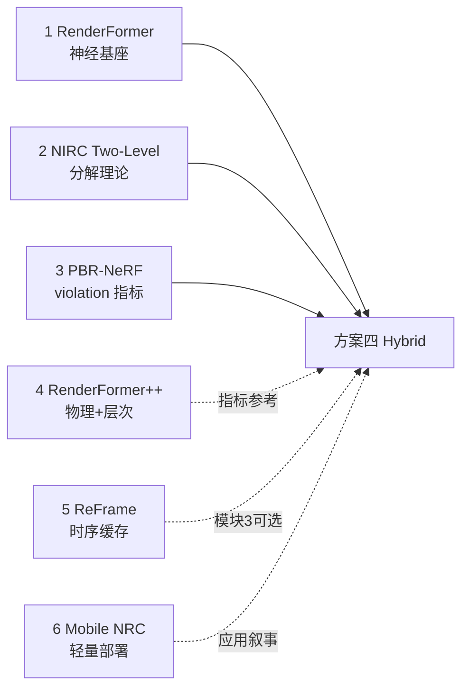

# 方案四：相关论文解析与下载索引

> **用途**：配合 [scheme4_hybrid_gi_plan.md](./scheme4_hybrid_gi_plan.md) 阅读；按优先级排序。  
> **建议节奏**：第 1 周读 §1–3（必读）；第 2 周读 §4–6（扩展）；§7 作应用参考。

---

## 阅读路线总览



---

## §1 RenderFormer（必读 ★★★★★）

### 基本信息

| 项 | 内容 |
|----|------|
| 标题 | RenderFormer: Transformer-based Neural Rendering of Triangle Meshes with Global Illumination |
| 会议 | SIGGRAPH 2025 |
| 与方案四关系 | **神经侧基座**；理解 VI/VD 分工、HDR 输出、局限与 future work |

### 下载链接

| 类型 | URL |
|------|-----|
| **PDF（官方）** | https://renderformer.github.io/pdfs/renderformer-paper.pdf |
| arXiv | https://arxiv.org/abs/2505.21925 |
| arXiv HTML | https://arxiv.org/html/2505.21925v1 |
| 项目页 | https://microsoft.github.io/renderformer/ |
| 代码 | https://github.com/microsoft/renderformer |
| 权重 Base | https://huggingface.co/microsoft/renderformer-v1-base |
| 权重 Large | https://huggingface.co/microsoft/renderformer-v1.1-swin-large |

### 解析：你需要带走什么

**架构**

- **VI（12 层）**：三角序列自注意力，建模 triangle-to-triangle 光传输 equilibrium；与相机无关 → 你的 `ViewIndependentCache` 合理。  
- **VD（6 层）**：ray-bundle token + cross-attention 到 VI 输出；与相机、分辨率相关 → hybrid 融合放在 **VD 之后**。  
- 限制：约 4096 三角、quadratic attention；作者明确 future work 包括 **sparse attention + BVH/LoD**。

**输出特性**

- 线性 HDR（非 LDR 时 texture 光照通道 `log10` 编码）。  
- 与 Blender 同相机系（-Z 视向，+Y 上）→ classic pass 对齐可行。

**对方案四的启示**

| 论文观点 | 你的用法 |
|----------|----------|
| 「minimal prior constraints」→ 易出现物理越界 | 用 classic direct + violation 修正 |
| future: hierarchical/sparse attention | 与方案二并行，不阻塞方案四 |
| 两阶段可分开计时 | 论文里报告 RF 与 hybrid 开销分项 |

**精读章节**：Method §3（两阶段）、Results（失败 case）、Conclusion future work。

---

## §2 Neural Two-Level MC + NIRC（必读 ★★★★★）

### 基本信息

| 项 | 内容 |
|----|------|
| 标题 | Neural Two-Level Monte Carlo Real-Time Rendering |
| 会议 | Eurographics 2025 |
| 与方案四关系 | **理论对标**：shading 积分 = 神经近似 + 残差补偿 |

### 下载链接

| 类型 | URL |
|------|-----|
| 项目页（含视频、说明） | https://mishok43.github.io/nirc/ |
| 代码 | https://github.com/Mishok43/IVD_NIRC |
| EG 2025 论文 | 见项目页 PDF 链接（Conference Track） |

> 若项目页 PDF 不可用，可检索：`Neural Two-Level Monte Carlo Real-Time Rendering Eurographics 2025`。

### 解析：Two-Level 估计器

核心公式（概念）：

\[
\underbrace{\int f(x) \, \mathrm{d}x}_{\text{完整 shading}} \approx \underbrace{\int f_{\text{NIRC}}(x) \, \mathrm{d}x}_{\text{神经缓存（快）}} + \underbrace{\int \big(f(x) - f_{\text{NIRC}}(x)\big) \, \mathrm{d}x}_{\text{残差（慢 path trace）}}
\]

**NIRC 特点**

- 极小 fully-fused MLP，**在线训练**。  
- 评估比 1 次 path sample 快 2–25×。  
- 残差项保证 **零偏**（unbiased）。

**方案四的「轻量版 Two-Level」映射**

| NIRC 原版 | 方案四（推理侧） |
|-----------|------------------|
| 在线 MLP 近似 radiance | 预训练 RenderFormer 全图 HDR |
| 实时 path trace 残差 | **离线** Blender direct（或 GT−neural 预计算 Δ） |
| on-the-fly 训练 | **零训练** |
| 实时 60fps 目标 | 编辑器预览 / 批量渲图 |

**论文叙事句（可改写进 Related Work）**

> 受 Two-Level Monte Carlo 分解启发，我们将 feed-forward 神经 GI 视为快速近似项，将经典 direct lighting 作为可验证的物理分项；confidence map 扮演残差信任调度，在无需在线 path tracing 的前提下降低神经越界带来的偏差。

**精读重点**：Two-Level 分解图、NIRC vs path trace 误差、动态场景表现。

---

## §3 PBR-NeRF（必读 ★★★★☆）

### 基本信息

| 项 | 内容 |
|----|------|
| 标题 | PBR-NeRF: Inverse Rendering with Physics-Based Neural Fields |
| 会议 | CVPR 2025 |
| 与方案四关系 | **violation 指标设计**；能量守恒、高光分离 |

### 下载链接

| 类型 | URL |
|------|-----|
| **PDF（CVF Open Access）** | https://openaccess.thecvf.com/content/CVPR2025/papers/Wu_PBR-NeRF_Inverse_Rendering_with_Physics-Based_Neural_Fields_CVPR_2025_paper.pdf |
| arXiv | https://arxiv.org/abs/2412.09680 |
| 项目页 | https://s3anwu.github.io/pbrnerf/ |
| 代码 | https://github.com/s3anwu/pbrnerf |

### 解析：两个 physics loss → 你的 inference violation

| PBR-NeRF Loss | 物理含义 | 方案四 inference 代理 |
|---------------|----------|------------------------|
| \(\mathcal{L}_{\text{cons}}\) | BRDF 能量守恒 | `viol_energy`：HDR > 纹理代理上界 \(L_{\text{soft}}\) |
| \(\mathcal{L}_{\text{spec}}\) | diffuse/specular 分离 | 高梯度+高亮区 `viol_gradient`；classic specular AOV 策略 B |

**关键区别**

- PBR-NeRF：**训练时**反传 loss。  
- 方案四：**推理时**闭式检测 + confidence 降权，不重训。

**可引用的评测思路**

- 报告 violation rate before/after hybrid。  
- 分 material 类型（diffuse / glossy / emissive）统计。

**精读章节**：§3 Physics-Based Priors、Fig. BRDF envelope、ablation w/o losses。

---

## §4 RenderFormer++（选读 ★★★☆☆）

### 基本信息

| 项 | 内容 |
|----|------|
| 标题 | RenderFormer++: Scalable and Physically Grounded Feed-Forward Neural Rendering |
| 与方案四关系 | **勿对标训练**；借鉴 PITG、HOCT 的**评测与问题定义** |

### 下载链接

| 类型 | URL |
|------|-----|
| arXiv HTML | https://arxiv.org/html/2606.30380 |

### 解析要点

- **PITG**：渲染方程残差作为 transport consistency loss → 你可报告「推理后 violation 残差」作对照概念。  
- **HOCT**：object-level token 降序列长度 → 说明「我们不改架构，改 inference 可靠性」。  
- **定位**：RF++ 是 A 类架构创新；方案四是 B 类 **deployable hybrid pipeline**。

---

## §5 ReFrame: Layer Caching（选读 ★★★☆☆）

### 基本信息

| 项 | 内容 |
|----|------|
| 标题 | ReFrame: Layer Caching for Accelerated Inference in Real-Time Rendering |
| 与方案四关系 | 若接 **模块 3 时序** + VI cache，Related Work 可引用 |

### 下载链接

| 类型 | URL |
|------|-----|
| arXiv | https://arxiv.org/abs/2506.13814 |
| 项目页 | https://ubc-aamodt-group.github.io/reframe-layer-caching/ |
| PMLR | https://proceedings.mlr.press/v267/liu25a.html |

### 解析要点

- 渲染 NN 中复用**上一帧中间特征**，平均 ~1.4× 加速。  
- 与 classic pass 缓存**正交**：一个缓存神经层特征，一个缓存物理 direct EXR。  
- 方案四 + VI cache + ReFrame 式 VD 层缓存 = 论文「效率」小节扩展。

---

## §6 NeRFBuff / Mobile NRC（选读 ★★☆☆☆）

### NeRFBuff（时序特征缓冲）

| 类型 | URL |
|------|-----|
| TVCG / DOI | https://doi.org/10.1109/tvcg.2024.3393715 |

**要点**：多平面 history buffer + warp → 支撑模块 3「光流混合」叙事。

### Mobile Neural Radiance Cache

| 类型 | URL |
|------|-----|
| DOI | https://doi.org/10.1145/3757376.3771399 |

**要点**：移动端 fused MLP + compute shader → 论文 **Application**「低算力部署」段落。

---

## §7 StreamSplat（应用参考 ★★☆☆☆）

| 类型 | URL |
|------|-----|
| 项目页 | https://streamsplat.pengpark.com/ |
| Web3D 2025 | https://www.siggraph.org/wp-content/uploads/2025/08/Web3D.html |

**要点**：服务端神经渲 + 客户端轻量合成 → 方案四可写「服务端 RF+hybrid，客户端仅 tone map」。

---

## 论文 ↔ 方案四模块对照表

| 论文章节/概念 | 方案四模块 | 实施文档章节 |
|---------------|------------|--------------|
| RenderFormer VI/VD | 神经 HDR 来源 | plan §2.4 |
| NIRC Two-Level 分解 | Direct+Indirect / 策略 C | plan §3 |
| PBR-NeRF \(\mathcal{L}_{\text{cons}}\) | `viol_energy`, \(L_{\text{soft}}\) | plan §4 |
| PBR-NeRF \(\mathcal{L}_{\text{spec}}\) | `viol_gradient`, 策略 B | plan §3.2 |
| ReFrame / NeRFBuff | 模块 3 时序（可选） | project_c §3.3 |
| Mobile NRC | 应用：低算力 | plan §7 |

---

## 建议阅读笔记模板（每篇 30 分钟）

复制以下模板到个人笔记，读完勾选：

```markdown
### [论文简称]
- **问题**：
- **方法一句话**：
- **实验数据集**：
- **主指标**：
- **局限**：
- **可抄到方案四的**：（公式 / 指标 / 图类型）
- **不必做的**：（训练规模 / 硬件）
```

---

## 下载检查清单

- [ ] RenderFormer PDF  
- [ ] NIRC 项目页材料  
- [ ] PBR-NeRF CVF PDF  
- [ ] （可选）RenderFormer++ arXiv  
- [ ] （可选）ReFrame arXiv  

全部读完后，回到 [scheme4_hybrid_gi_plan.md §11](./scheme4_hybrid_gi_plan.md#11-下一步行动本周) 开始 Phase 0 实施。
